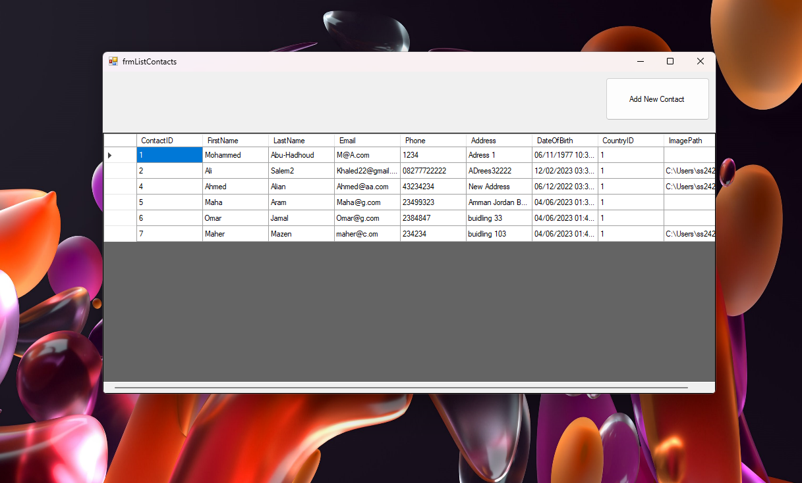
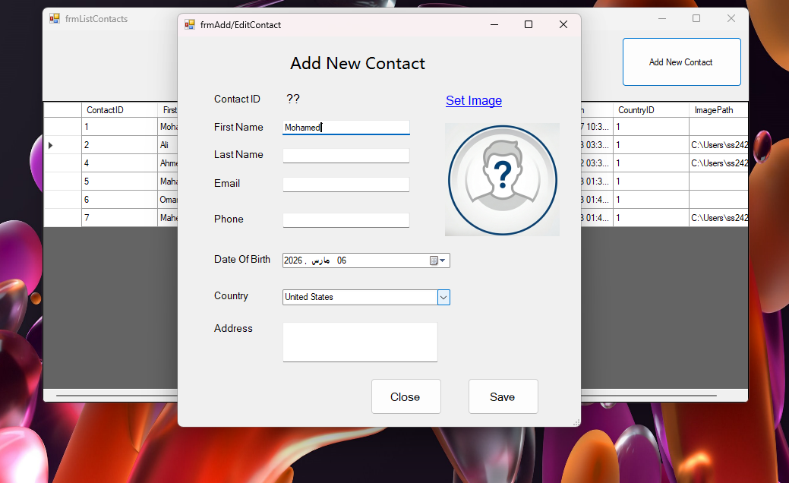
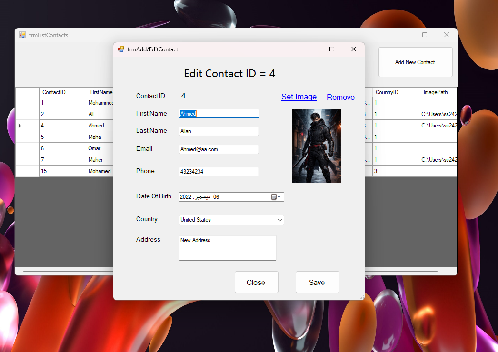

# Contacts Management System

## 📌 Project Overview

Contacts Management System is a Windows Forms desktop application developed to manage contact information efficiently.

The system provides an easy way for organizations and individuals to store contact data, organize records, and manage communication effectively.

This project was built as part of practical training while studying desktop application development.

---

## 🏗 System Architecture

The project follows a **3-Tier Architecture**:

1. **Presentation Layer**

   * Windows Forms UI
   * Handles user interaction

2. **Business Logic Layer (BLL)**

   * Processes system rules
   * Validates data

3. **Data Access Layer (DAL)**

   * Communicates with SQL Server
   * Executes queries & stored procedures

---

## 🛠 Technologies Used

* C#
* .NET Framework – Windows Forms
* SQL Server
* ADO.NET
* Visual Studio

---

## ✨ System Features

### 👤 Contacts Management

* Add new contacts
* Edit contacts data
* Delete contacts
* View contacts list
* Search contacts

### 📅 Data Handling

* Organized database structure
* Secure data storage
* Efficient data retrieval

---

## 🗄 Database Design

Main Tables:

* **Contacts**

  * ContactID (PK)
  * FirstName
  * LastName
  * Phone
  * Email
  * Address

---

## ⚙️ Installation & Setup

1️⃣ Clone the repository

```bash
git clone https://github.com/ss24214859/Course-Abu-Hadhoud.git
```

2️⃣ Open the solution file in Visual Studio.

3️⃣ Setup Database

* Open SQL Server Management Studio.
* Create a new database.
* Run the provided SQL script.

4️⃣ Update Connection String

Edit:

```
App.config
```

Add your SQL Server connection string.

5️⃣ Run the project.

---

## 📷 Screenshots

### 👤 Contacts List



### ➕ Add Contact



### ✏️ Edit Contact



---

## 🚀 Future Enhancements

* User Authentication System
* Contact Categories
* Export to Excel / PDF
* Contact Dashboard UI
* Import/Export contacts

---

## 👨‍💻 Author

**Student**

* GitHub: [https://github.com/ss24214859](https://github.com/ss24214859)

---

## 📜 License

This project is for learning purposes and training.
